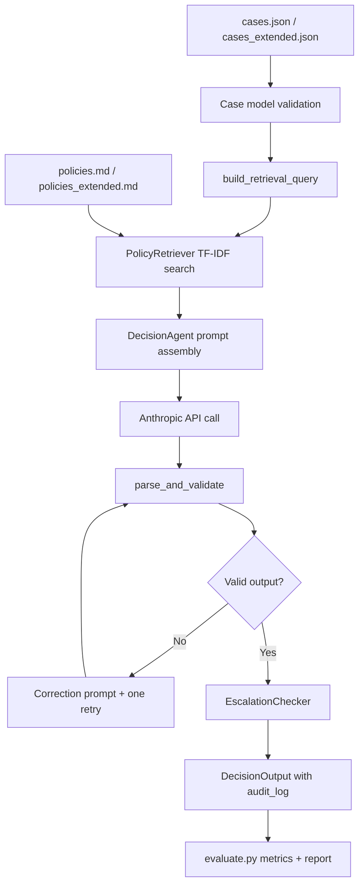

# Orion AI Decision Agent

Policy-grounded compliance decisioning pipeline for payout review cases that returns structured `APPROVE` / `DENY` / `ESCALATE` decisions with audit metadata and deterministic safety overrides.

## Requirements

- Python `3.11+` recommended (project also runs in this environment on Python `3.9`, but target is `3.11+`)
- Anthropic API key with access to `claude-sonnet-4-5`
- All Python dependencies are listed in `requirements.txt`

## Setup

1) Clone the repository

```bash
git clone <your-repo-url>
cd mogo
```

2) Create and activate a virtual environment

```bash
python3 -m venv venv
source venv/bin/activate
```

Windows (PowerShell):

```powershell
python -m venv venv
venv\Scripts\activate
```

3) Install dependencies

```bash
pip install -r requirements.txt
```

4) Configure environment variables

Copy the example file and add your key:

```bash
cp .env.example .env
```

`.env.example` contents:

```env
ANTHROPIC_API_KEY=your_key_here
ANTHROPIC_BASE_URL=https://api.anthropic.com
```

Update `.env` with your real key value for `ANTHROPIC_API_KEY`.

5) Optional sanity check before running the evaluator

```bash
python3 retriever.py
```

Expected output:

```text
Setup validated: 7 policies, 14 cases loaded.
```

## Running the evaluation

Baseline mode (default):

```bash
python3 evaluate.py
```

Extended mode:

```bash
python3 evaluate.py --mode extended
```

Alternative extended mode selector:

```bash
EVAL_MODE=extended python3 evaluate.py
```

Expected report format:

```text
============================================================
  ORION DECISION AGENT — EVALUATION REPORT
============================================================

Total cases run : <N>
Approve         : <N>
Deny            : <N>
Escalate        : <N>

Overall accuracy (vs labels) : <pct>%  (<correct>/<total>)

By difficulty tier:
  Straightforward (<N>) — NOT escalated : <pct>%  (<n>/<N>)    ✓/✗ target ≥ 85%
  Ambiguous       (<N>) — Escalated     : <pct>%  (<n>/<N>)    ✓/✗ target ≥ 75%
  Edge cases      (<N>) — Escalated     : <pct>%  (<n>/<N>)    ✓/✗ target 100%

Operational indicators:
  Retry attempted cases: <n>/<N> (<pct>%)
  Average confidence   : <value>

------------------------------------------------------------
  Per-case breakdown
------------------------------------------------------------
  CASE-xxx | <difficulty> | Expected: <label> | Got: <label> | PASS/FAIL
============================================================
Runtime: <seconds>s
```

Current observed runs in this repository:

- Baseline mode: `14/14` correct (`100.0%`)
- Extended mode: `11/12` correct (`91.7%`)

## Running a single case

Run full pipeline smoke path for two representative cases (`CASE-001`, `CASE-013`):

```bash
python3 validator.py
```

What this gives you:

- Final validated decision
- Confidence score
- Policy citations
- Retry indicator
- Error detail (when escalation guardrails trigger)

Optional single-case agent smoke test (raw model output before validator):

```bash
python3 agent.py
```

## Running tests

Run all tests:

```bash
pytest tests/ -v
```

Test suite coverage includes:

- Foundation/data-contract checks (`tests/part1`)
- Core module unit tests (`tests/test_*.py`)
- Stress robustness tests (`tests/stress`)

Current status in this repository: `24 passed`.

## Project structure

- `config.py` - central constants, thresholds, model config, environment loading
- `models.py` - Pydantic input/output contracts and validators
- `retriever.py` - policy parsing, TF-IDF index, retrieval query enrichment, setup validation
- `agent.py` - prompt layer, Anthropic API wrapper, single-case decision orchestration
- `validator.py` - parse/validate/retry/escalation checker and pipeline composition (`run_pipeline`)
- `evaluate.py` - batch runner, metrics computation, report rendering, mode selection
- `policies.md` - baseline policy corpus (7 policies)
- `cases.json` - baseline dataset (14 labeled cases)
- `policies_extended.md` - extended policy corpus (19 policies)
- `cases_extended.json` - extended dataset (12 labeled cases with richer signals)
- `tests/conftest.py` - shared fixtures/constants
- `tests/test_retriever.py` - retriever and query enrichment unit tests
- `tests/test_agent.py` - decision agent behavior tests with mocked API calls
- `tests/test_validator.py` - parser/retry/escalation checker tests
- `tests/test_evaluate.py` - metric computation tests
- `tests/part1/test_part1_foundation.py` - milestone baseline contract and data checks
- `tests/stress/harness.py` - malformed-response stress fixtures
- `tests/stress/test_stress_harness.py` - stress-path behavior tests
- `design.md` - concise architecture and design rationale narrative
- `docs/SYSTEM_DESIGN.md` - full architecture specification and implementation rationale
- `docs/BUILD_PLAN_PART1.md` - milestone/ticket plan (M1-M3)
- `docs/BUILD_PLAN_PART2.md` - milestone/ticket plan (M4-M6)
- `docs/PRD (1).md` - requirements baseline

## Design decisions

This system intentionally uses TF-IDF retrieval + strict Pydantic output contracts + deterministic ESCALATE guardrails to prioritize auditability and safety over raw model autonomy. See `design.md` for the concise assignment narrative and `docs/SYSTEM_DESIGN.md` for full architectural detail.

## System design diagram



## Baseline vs extended modes

- Baseline mode (`cases.json` + `policies.md`) validates core assignment behavior: 8 straightforward, 4 ambiguous, 2 edge cases.
- Extended mode (`cases_extended.json` + `policies_extended.md`) expands signal surface area (device trust, impossible travel, sanctions hits, KYC staleness/confidence, payout drift, cross-system conflicts).
- The same pipeline runs both modes with no code changes; only dataset/policy inputs change via `--mode`.
- Extended mode is intentionally harder and reveals realistic failure pressure, especially on edge-tier precision.

## Evaluation metrics and print semantics

- `Total/Approve/Deny/Escalate` are raw output counts from model + guardrail decisions.
- `Overall accuracy` compares `got` vs `expected_decision`.
- `Straightforward NOT escalated` rewards avoiding unnecessary human handoff on clear cases.
- `Ambiguous escalated` and `Edge escalated` track safety posture under uncertainty/conflict.
- `Retry attempted cases` surfaces output-contract reliability (JSON/schema adherence on first pass).
- `Average confidence` gives a coarse calibration signal for monitoring confidence drift over time.

## Production design notes

- Retrieval and decision logic are cleanly separated (`retriever.py` vs `agent.py`), so retrieval strategy can be upgraded (hybrid/embedding) without rewriting validator/evaluator.
- Validation is schema-first (`DecisionOutput`) and citation-constrained to retrieved policies, reducing hallucinated policy references.
- Deterministic escalation rules enforce safety invariants even when model confidence or output appears valid.
- All critical runtime paths fail safe to structured `ESCALATE` instead of raising uncaught exceptions.
- Audit metadata (`retrieved_policies`, retrieval score, retry flag, error detail, timestamp) is always attached for operator traceability.

## Engineering practices used

- Strong typed contracts via Pydantic validators (`extra="forbid"`, range checks, regex IDs)
- Defensive boundary handling for retrieval/API/parsing/validation paths
- Explicit module responsibilities and low-coupling interfaces
- Test-first verification across unit, foundation, and stress suites
- Reproducible dependency pinning and documented runbook commands
- Secret handling via `.env` and `python-dotenv`; no API key hardcoding

## Troubleshooting

- `python: command not found` on macOS/Linux shells: use `python3` in all commands.
- Missing API key errors: confirm `.env` exists and includes `ANTHROPIC_API_KEY=<real_key>`.
- Slow evaluator runs: expected with live LLM calls; use progress lines shown by `evaluate.py`.
- Unexpected ESCALATE spikes: inspect per-case output and `audit_log.error_detail` for escalation reasons.
